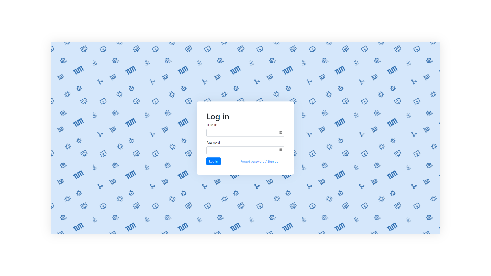

 

     
    
    <h3>Basic Tutor Website Template</h3>

Tutorweb is a (boilerplate-)template for making a website for a tutor class (especially in TUM). It is powered with login system which prevent people accessing material directly without proving their student status.

The principle of this project is only letting the tutor to only know if the person is an active student. This (hopefully) prevents any personal information leaks if a database is leaked.

# Requirement
- PHP 7.x
- Database (MySql)
- A SMTP Server

# How it works
1. Student can sign up for an account using their id.
2. Since every active student has permanent E-Mail address which has same pattern including their id, the system will automatically sends the random generated password to the student via E-Mail.
3. Student can access the tutor page after logging in to the login page.

# Usage
1. Edit the configuration file (`config.php`)
2. Make a table that will be used to store users credential (the structure is below)

    | Field         	| Type         	| Null 	| Key 	| Default 	| Extra 	|
    |---------------	|--------------	|------	|-----	|---------	|-------	|
    | tumid         	| char(7)      	| NO   	| PRI 	| NULL    	|       	|
    | password      	| varchar(255) 	| NO   	|     	| NULL    	|       	|
    | creation_time 	| timestamp    	| NO   	|     	| NULL    	|       	|

3. Upload files to your server and make server adjustment accordingly

# Credits
- My friends who helped me
- [Icons8](https://icons8.com/) for the icons used in background